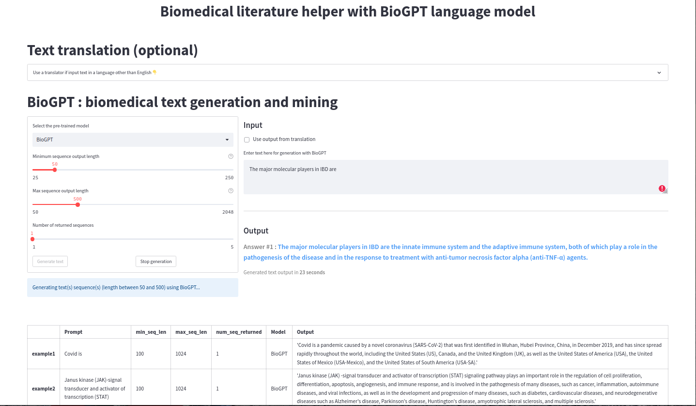

# BioGPT Streamlit app

## About the app
2 part component Streamlit app with text translation using Google Translate (or DeepL) and biomedical text generation using the BioGPT generative transformer model pre-trained on specific data.

The code is not well structured and it results with a bit of a clunkiness in the app. It was more of an exercise to use the Streamlit API and test BioGPT.

An free tier app can be deployed on Streamlit but only the translator will work since running the text generation obviously requires too much memory and GPU power for a free tier.

### Text translation
Using the Python [translators](https://github.com/uliontse/translators) API, the app allows you to use either DeepL or Google with respective available choices or their find auto feature.

### BioGPT text generation
Choice of 3 pre-trained model for biomedical text generation and mining. All parameters were based on the official [Microsoft/BioGPT](https://huggingface.co/microsoft/biogpt) model published on the huggingface platform.

Examples are output from locally ran queries.

More info can be found in the official publication : 
- doi : https://doi.org/10.1093/bib/bbac409
- eprint = https://academic.oup.com/bib/article-pdf/23/6/bbac409/47144271/bbac409.pdf

### Local use (playground)
1. Install requirements

`pip install -r requirements.txt`

2. Run it locally on Streamlit

`streamlit run main_app.py`

### Demo
Non-functional (translation OK, text generation will not work, see comments above) live demo can be checked here : https://simlal-biogpt-streamlit-main-app-uct3jy.streamlit.app/
